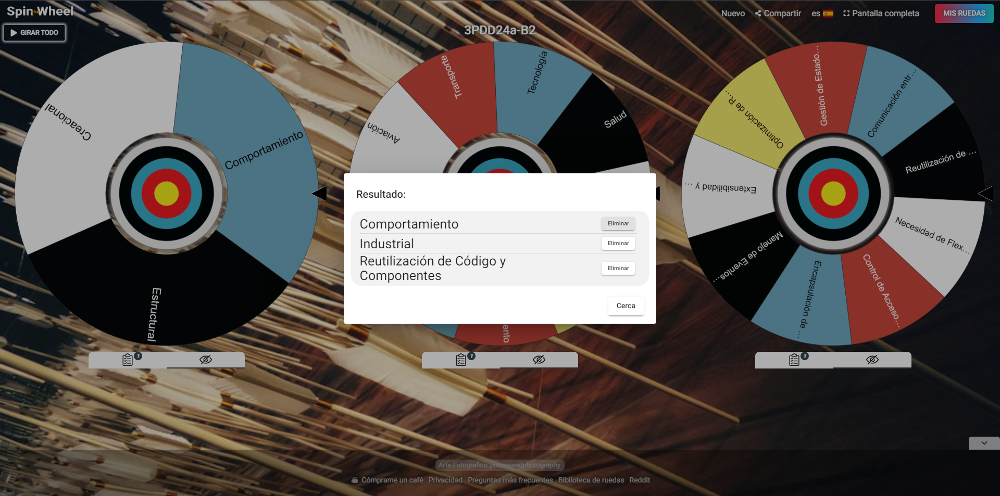

# Command

<p align="justify">
Para implementar un patrón de comportamiento en el contexto industrial con enfoque en la reutilización de código y componentes, el patrón Command lo podemos usar.

  - Descripción: Encapsula una solicitud como un objeto, permitiendo parametrizar clientes con diferentes solicitudes y soportar operaciones de deshacer.
  - Uso Común: Implementación de acciones como objetos, operaciones deshacer/rehacer.
<p align="justify">

# Ejemplo en C#: Sistema de control de maquinaria

<p align="justify">
  
Tenemos una aplicación industrial que controla diferentes máquinas. Estas máquinas pueden ejecutar comandos como "Encender", "Apagar", y "Reiniciar". Utilizaremos el patrón Command para implementar estas acciones.

Comandos: Hay tres comandos concretos (EncenderMaquinaCommand, ApagarMaquinaCommand, ReiniciarMaquinaCommand) que encapsulan acciones sobre la máquina.

Reutilización: Los comandos son reutilizables y pueden ser asignados a diferentes máquinas, lo que facilita la extensión de funcionalidades sin cambiar el código base.

</p>

# Código C#

```
using System;
using System.Collections.Generic;

// Interfaz del comando
public interface ICommand
{
    void Execute();
    void Undo(); // Para soportar deshacer si es necesario
}

// Clase receptora que representa una máquina
public class Maquina
{
    public string Nombre { get; }

    public Maquina(string nombre)
    {
        Nombre = nombre;
    }

    public void Encender()
    {
        Console.WriteLine($"La máquina {Nombre} está encendida.");
    }

    public void Apagar()
    {
        Console.WriteLine($"La máquina {Nombre} está apagada.");
    }

    public void Reiniciar()
    {
        Console.WriteLine($"La máquina {Nombre} está reiniciando.");
    }
}

// Comando para encender la máquina
public class EncenderMaquinaCommand : ICommand
{
    private Maquina _maquina;

    public EncenderMaquinaCommand(Maquina maquina)
    {
        _maquina = maquina;
    }

    public void Execute()
    {
        _maquina.Encender();
    }

    public void Undo()
    {
        _maquina.Apagar();
    }
}

// Comando para apagar la máquina
public class ApagarMaquinaCommand : ICommand
{
    private Maquina _maquina;

    public ApagarMaquinaCommand(Maquina maquina)
    {
        _maquina = maquina;
    }

    public void Execute()
    {
        _maquina.Apagar();
    }

    public void Undo()
    {
        _maquina.Encender();
    }
}

// Comando para reiniciar la máquina
public class ReiniciarMaquinaCommand : ICommand
{
    private Maquina _maquina;

    public ReiniciarMaquinaCommand(Maquina maquina)
    {
        _maquina = maquina;
    }

    public void Execute()
    {
        _maquina.Reiniciar();
    }

    public void Undo()
    {
        Console.WriteLine($"La acción de reiniciar la máquina { _maquina.Nombre } no se puede deshacer.");
    }
}

// Clase invocadora que ejecuta comandos
public class Controlador
{
    private List<ICommand> _historialComandos = new List<ICommand>();

    public void EjecutarComando(ICommand comando)
    {
        comando.Execute();
        _historialComandos.Add(comando);
    }

    public void DeshacerUltimoComando()
    {
        if (_historialComandos.Count > 0)
        {
            var ultimoComando = _historialComandos[_historialComandos.Count - 1];
            ultimoComando.Undo();
            _historialComandos.RemoveAt(_historialComandos.Count - 1);
        }
    }
}

// Ejemplo de uso
class Program
{
    static void Main(string[] args)
    {
        // Crear receptor (máquina)
        Maquina maquina1 = new Maquina("Maquina 1");

        // Crear comandos
        ICommand encenderMaquina = new EncenderMaquinaCommand(maquina1);
        ICommand apagarMaquina = new ApagarMaquinaCommand(maquina1);
        ICommand reiniciarMaquina = new ReiniciarMaquinaCommand(maquina1);

        // Crear invocador
        Controlador controlador = new Controlador();

        // Ejecutar comandos
        controlador.EjecutarComando(encenderMaquina);
        controlador.EjecutarComando(reiniciarMaquina);
        controlador.EjecutarComando(apagarMaquina);

        // Deshacer el último comando (apagar)
        controlador.DeshacerUltimoComando();
    }
}

```

https://dotnetfiddle.net/Ekq6zc
